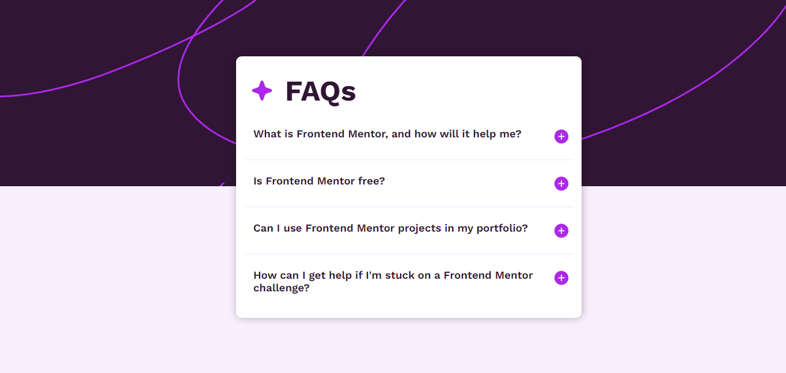

# Frontend Mentor - FAQ accordion solution

This is a solution to the [FAQ accordion challenge on Frontend Mentor](https://www.frontendmentor.io/challenges/faq-accordion-wyfFdeBwBz). Frontend Mentor challenges help you improve your coding skills by building realistic projects. 

## Table of contents

- [Overview](#overview)
  - [The challenge](#the-challenge)
  - [Screenshot](#screenshot)
- [My process](#my-process)
  - [Built with](#built-with)
  - [What I learned](#what-i-learned)
- [Author](#author)


## Overview

### The challenge

Users should be able to:

- Hide/Show the answer to a question when the question is clicked
- Navigate the questions and hide/show answers using keyboard navigation alone
- View the optimal layout for the interface depending on their device's screen size
- See hover and focus states for all interactive elements on the page

### Screenshot



## My process

I started creating the structure by using HTML and then desigining the site with CSS. I did not know any JS and am still learning so I searched on google and also used AI to get help for that part.

### Built with

- Semantic HTML5 markup
- CSS custom properties
- Flexbox
- JS

### What I learned

I learnt about EventListerners and a bit of JS

```js
addEventListener("click", () => {}
```

### Continued development

Going to focus on JS and learn how to add a smooth transition for the svg transformation when clicking the icon to reveal the answers

## Author

- Website - [Add your name here](https://r-ddle.netlify.app)
- Frontend Mentor - [@yourusername](https://www.frontendmentor.io/profile/r-ddle)
